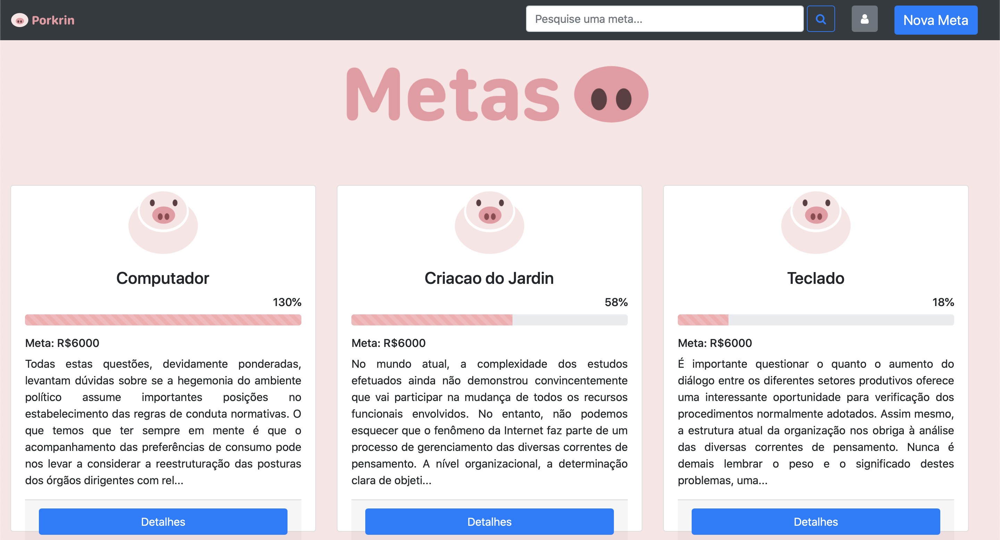
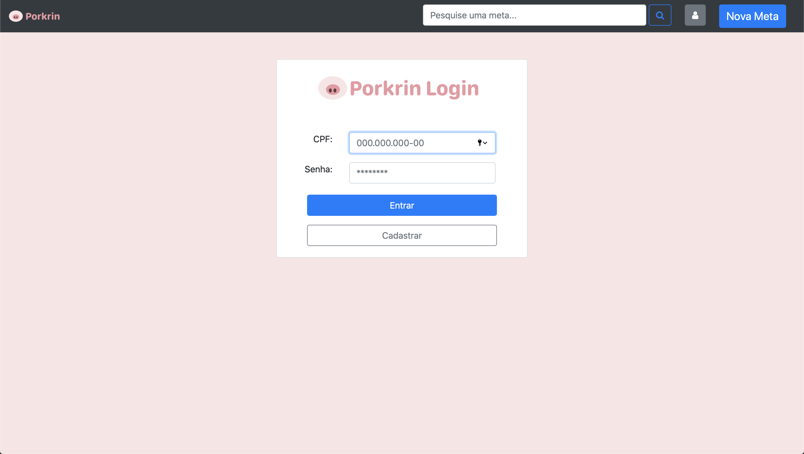
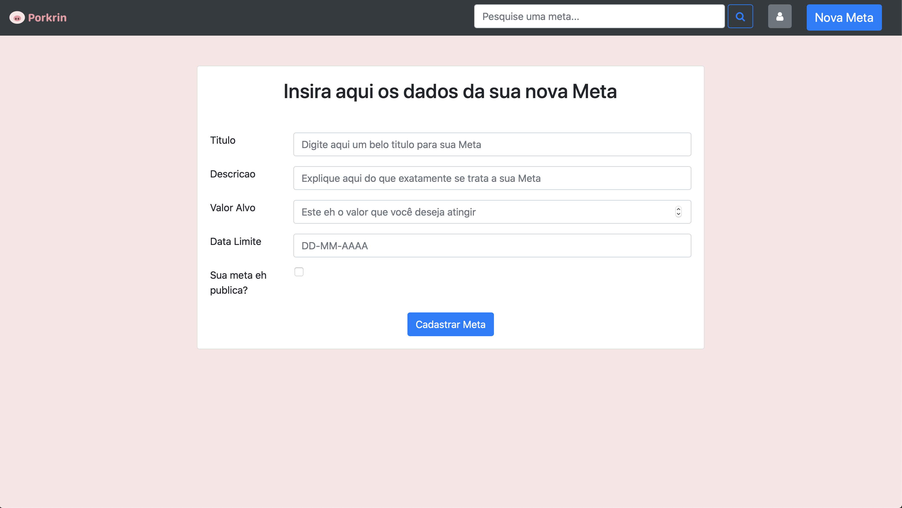
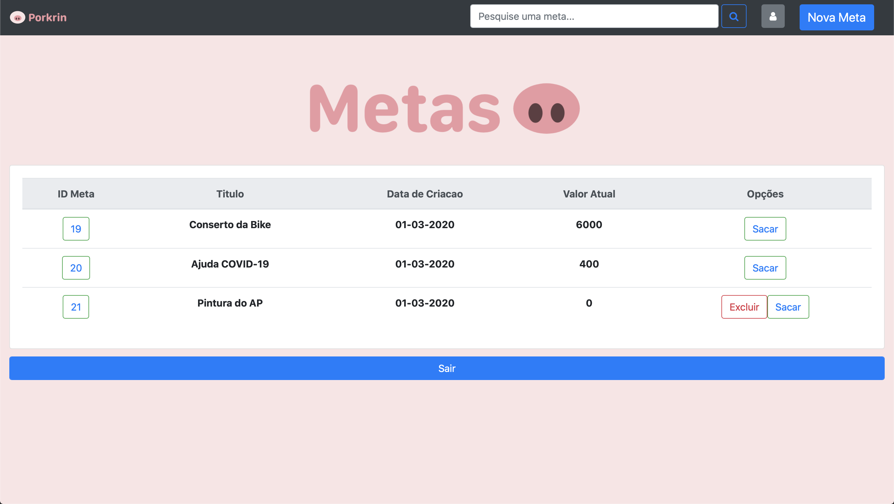

# Porkrin 
## WebProjetoFinal | Vaquinha Virtual

Ex.: Dois irmãos querem comprar um computador e vão dividir a conta. Eles podem ir adicionando valores ao longo do tempo.

### Funcionalidades

- Criar novas metas de vaquinha;
- Participar de vaquinhas já criadas, anonimamente ou não;
- Notificar o criador da vaquinha quando a meta for alcançada.

### Entidades:

**Meta**
- Dono
- Titulo
- Objetivo : Descricao
- Valor atual
- Valor a ser alcançado
- Imagem
- Data limite (opcional) 
- Público

**Banco**
- Dados Bancarios

**Notificações** 
- Mensagem
- IdDono

**Transação** 
- IdMeta
- IdDoador
- Datetime
- Valor
- Msg para o dono

**Usuário** 
- Nome 
- Sobrenome
- CPF
- Email
- Senha
- Telefone

**Saque** 
- valor
- datetime
- status

# Porkrin Screenshots 

